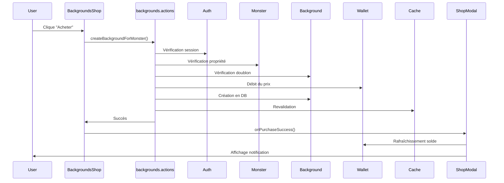

# Système de Backgrounds - Documentation Complète

## 📋 Vue d'ensemble

Le système de backgrounds permet aux utilisateurs d'acheter et d'équiper des arrière-plans personnalisés pour leurs monstres Tamagotchi. Cette fonctionnalité s'intègre parfaitement avec la boutique existante et suit les mêmes conventions que le système d'accessoires.

## 🏗️ Architecture

### Structure des fichiers créés

```
src/
├── types/
│   └── background.ts                    # Types TypeScript pour les backgrounds
├── config/
│   └── backgrounds.config.ts            # Catalogue des backgrounds disponibles
├── actions/
│   └── backgrounds.actions.ts           # Server actions pour la gestion des backgrounds
└── components/
    └── shop/
        └── backgrounds-shop.tsx         # Composant boutique de backgrounds
```

### Fichiers modifiés

```
src/
└── components/
    └── creature/
        └── shop-modal.tsx               # Ajout de l'onglet backgrounds
```

## 📦 Détails des fichiers

### 1. Types (`/src/types/background.ts`)

Définit les interfaces TypeScript pour les backgrounds :

- **`DBBackground`** : Représentation d'un background en base de données
- **`BackgroundData`** : Données nécessaires lors de l'achat d'un background
- **`BackgroundConfig`** : Configuration d'un background dans le catalogue

### 2. Configuration (`/src/config/backgrounds.config.ts`)

Catalogue des 5 backgrounds disponibles :

| Background | Prix | Catégorie | Populaire |
|------------|------|-----------|-----------|
| 🏠 Maison Cosy | 100 Koins | cosy | ⭐ Oui |
| 🏰 Royaume Fantastique | 200 Koins | fantasy | ⭐ Oui |
| 🚀 Station Spatiale | 250 Koins | scifi | Non |
| ⚙️ Ville Steampunk | 300 Koins | steampunk | ⭐ Oui |
| 🌲 Forêt Sombre | 150 Koins | nature | Non |

**Fonctions utilitaires :**
- `findBackgroundById(id)` : Recherche un background par son ID
- `filterBackgroundsByCategory(category)` : Filtre les backgrounds par catégorie

### 3. Server Actions (`/src/actions/backgrounds.actions.ts`)

Cinq server actions suivant les principes SOLID :

#### **`createBackgroundForMonster(monsterId, backgroundData)`**
- ✅ Achète un background pour un monstre
- ✅ Vérifie l'authentification de l'utilisateur
- ✅ Vérifie la propriété du monstre
- ✅ Empêche l'achat de doublons
- ✅ Débite le wallet automatiquement
- ✅ Revalide le cache de la page

#### **`equipBackgroundToMonster(monsterId, backgroundId)`**
- ✅ Équipe un background acheté sur un monstre
- ✅ Vérifie que le background appartient au monstre
- ✅ Met à jour le champ `equipedBackground`

#### **`unequipBackgroundFromMonster(monsterId)`**
- ✅ Retire le background actuel d'un monstre
- ✅ Remet le champ à une chaîne vide

#### **`getBackgroundsForMonster(monsterId)`**
- ✅ Récupère tous les backgrounds achetés pour un monstre
- ✅ Utile pour afficher l'inventaire

#### **`getEquippedBackground(monsterId)`**
- ✅ Récupère le background actuellement équipé
- ✅ Retourne `null` si aucun background équipé

### 4. Composant Boutique (`/src/components/shop/backgrounds-shop.tsx`)

Composant React client-side pour l'interface d'achat :

**Fonctionnalités :**
- ✅ Affichage en grille responsive (1-3 colonnes)
- ✅ Filtrage par catégorie (Tous, Cosy, Fantaisie, Sci-Fi, Steampunk, Nature)
- ✅ Prévisualisation visuelle de chaque background
- ✅ Badge "Populaire" pour les backgrounds recommandés
- ✅ Vérification du solde avant achat
- ✅ Feedback visuel (messages d'erreur/succès)
- ✅ État de chargement pendant l'achat
- ✅ Animations fluides (fade-in, scale, shake)

**Props :**
```typescript
{
  monsterId: string              // ID du monstre
  currentBalance: number         // Solde actuel du wallet
  onPurchaseSuccess?: () => void // Callback après achat réussi
}
```

### 5. Intégration dans le Modal (`/src/components/creature/shop-modal.tsx`)

**Modifications apportées :**
- ✅ Import du composant `BackgroundsShop`
- ✅ Ajout du type `'backgrounds'` dans `ShopTab`
- ✅ Nouvel onglet "🖼️ Backgrounds" dans la navigation
- ✅ Section conditionnelle pour afficher la boutique de backgrounds
- ✅ Connexion au système de rafraîchissement du wallet

## 🎨 Backgrounds disponibles

Les backgrounds sont stockés dans `/public/backgrounds/` :

1. **cosy-tamagocho.png** - Intérieur chaleureux
2. **fantasy-tamagocho.png** - Monde magique
3. **scify-tamagocho.png** - Station spatiale futuriste
4. **steam-punk-tamagocho.png** - Ville rétro-futuriste
5. **gloomy-forest-tamagocho.png** - Forêt mystérieuse

## 🔄 Flux d'utilisation

### Achat d'un background



## 🛡️ Principes SOLID appliqués

### Single Responsibility Principle (SRP)
- Chaque fonction a une seule responsabilité
- `BackgroundsShop` : affichage uniquement
- Server actions : logique métier isolée

### Open/Closed Principle (OCP)
- Configuration extensible via `backgrounds.config.ts`
- Ajout de nouveaux backgrounds sans modifier le code

### Dependency Inversion Principle (DIP)
- Dépendance sur les abstractions (types, interfaces)
- Pas de dépendance directe sur l'implémentation

## 📊 Modèle de données

### Collection `backgrounds`

```typescript
{
  _id: ObjectId,
  monsterId: ObjectId,        // Référence au monstre
  url: string,                // Chemin vers l'image
  description: string,        // Description du background
  createdAt: Date,
  updatedAt: Date
}
```

### Champ `equipedBackground` dans `monsters`

```typescript
{
  equipedBackground: ObjectId | "",  // ID du background équipé
}
```

## 🚀 Utilisation

### Dans un composant

```typescript
import { BackgroundsShop } from '@/components/shop/backgrounds-shop'

function MyComponent() {
  const [balance, setBalance] = useState(500)
  
  return (
    <BackgroundsShop 
      monsterId="123abc"
      currentBalance={balance}
      onPurchaseSuccess={() => {
        // Rafraîchir le solde ou recharger les données
      }}
    />
  )
}
```

### Équiper un background

```typescript
import { equipBackgroundToMonster } from '@/actions/backgrounds.actions'

await equipBackgroundToMonster(monsterId, backgroundId)
```

### Récupérer le background équipé

```typescript
import { getEquippedBackground } from '@/actions/backgrounds.actions'

const background = await getEquippedBackground(monsterId)
if (background) {
  console.log(`Background actif: ${background.url}`)
}
```

## ✅ Checklist de vérification

- ✅ Types TypeScript définis
- ✅ Configuration des backgrounds créée
- ✅ Server actions implémentées
- ✅ Composant boutique créé
- ✅ Intégration dans le shop-modal
- ✅ Gestion des erreurs
- ✅ Vérifications de sécurité (auth, propriété)
- ✅ Prévention des doublons
- ✅ Débit automatique du wallet
- ✅ Revalidation du cache
- ✅ Feedback utilisateur (messages, animations)
- ✅ Design responsive
- ✅ Respect des principes SOLID

## 🎯 Prochaines étapes suggérées

1. **Affichage visuel** : Intégrer le background dans le composant de visualisation du monstre
2. **Inventaire** : Créer une page pour gérer les backgrounds achetés
3. **Équipement** : Ajouter des boutons pour équiper/déséquiper les backgrounds
4. **Animations** : Transition fluide lors du changement de background
5. **Catégories** : Ajouter plus de backgrounds dans différentes catégories
6. **Tests** : Créer des tests unitaires et d'intégration

## 📝 Notes techniques

- Les backgrounds sont des images PNG optimisées
- Le système utilise le modèle MongoDB existant `background.model.ts`
- Les prix sont en Koins (monnaie du jeu)
- Le wallet est automatiquement débité via `subtractKoins()`
- Les erreurs sont capturées et affichées de manière user-friendly

## 🔗 Fichiers liés

- `/src/db/models/background.model.ts` - Modèle MongoDB
- `/src/actions/wallet.actions.ts` - Gestion du wallet
- `/src/components/shop/accessories-shop.tsx` - Référence similaire
- `/public/backgrounds/` - Images des backgrounds

---

**Créé le :** 2 novembre 2025  
**Dernière mise à jour :** 2 novembre 2025  
**Version :** 1.0.0

