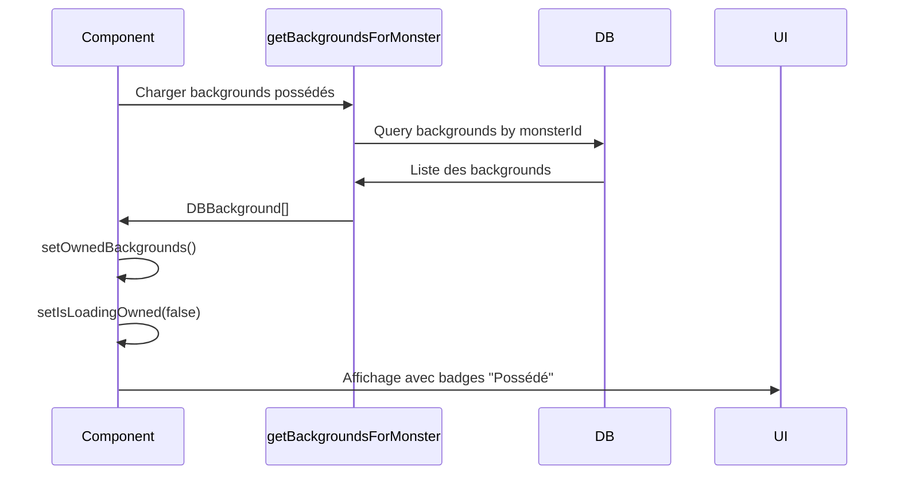
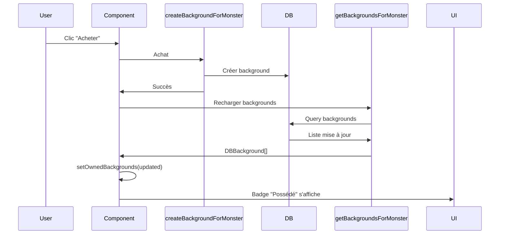

# 🔒 Prévention des Achats en Double - Implémentation

## 📋 Vue d'ensemble

Amélioration du système de boutique pour **empêcher l'achat d'articles déjà possédés** par le monstre. Cette fonctionnalité s'applique à la fois aux **backgrounds** et aux **accessoires**.

## 🎯 Objectif

Lorsqu'un monstre possède déjà un article (background ou accessoire), l'utilisateur ne peut plus l'acheter à nouveau :
- ✅ Le bouton d'achat est désactivé
- ✅ Un badge "✅ Possédé" s'affiche
- ✅ L'anneau de la carte devient vert
- ✅ Message clair : "Déjà possédé"

## 🛠️ Fichiers modifiés

### 1. `/src/components/shop/backgrounds-shop.tsx`

**Modifications apportées :**

#### Import des dépendances
```typescript
import { useState, useEffect } from 'react'
import { getBackgroundsForMonster } from '@/actions/backgrounds.actions'
import type { DBBackground } from '@/types/background'
```

#### Nouveaux states
```typescript
const [ownedBackgrounds, setOwnedBackgrounds] = useState<DBBackground[]>([])
const [isLoadingOwned, setIsLoadingOwned] = useState(true)
```

#### Chargement des backgrounds possédés
```typescript
useEffect(() => {
  async function loadOwnedBackgrounds(): Promise<void> {
    try {
      const backgrounds = await getBackgroundsForMonster(monsterId)
      if (backgrounds !== undefined) {
        setOwnedBackgrounds(backgrounds)
      }
    } catch (error) {
      console.error('Erreur lors du chargement des backgrounds possédés:', error)
    } finally {
      setIsLoadingOwned(false)
    }
  }

  void loadOwnedBackgrounds()
}, [monsterId])
```

#### Fonction de vérification
```typescript
function isBackgroundOwned(url: string): boolean {
  return ownedBackgrounds.some(bg => bg.url === url)
}
```

#### Rechargement après achat
```typescript
// Dans handlePurchase, après l'achat réussi
const updatedBackgrounds = await getBackgroundsForMonster(monsterId)
if (updatedBackgrounds !== undefined) {
  setOwnedBackgrounds(updatedBackgrounds)
}
```

#### Mise à jour de l'UI
```typescript
// Vérification de possession
const isOwned = isBackgroundOwned(background.url)
const canPurchase = canAfford && !isOwned && !isLoading

// Anneau vert pour les backgrounds possédés
${isOwned ? 'ring-4 ring-green-400' : ''}

// Badge "Possédé"
{isOwned && (
  <div className='absolute top-2 right-2 bg-gradient-to-r from-green-400 to-emerald-500 text-white text-xs font-bold px-2 py-1 rounded-full shadow-md z-10'>
    ✅ Possédé
  </div>
)}

// Bouton désactivé avec message
disabled={!canPurchase || isLoadingOwned}

{isOwned ? (
  <>
    <span className='text-xl'>✅</span>
    <span>Déjà possédé</span>
  </>
) : ...}
```

### 2. `/src/components/shop/accessories-shop-v2.tsx`

**Modifications identiques pour la cohérence :**

#### Import des dépendances
```typescript
import { useState, useEffect } from 'react'
import { getAccessoriesForMonster } from '@/actions/accessories.actions'
import type { DBAccessory } from '@/types/accessory'
```

#### Nouveaux states
```typescript
const [ownedAccessories, setOwnedAccessories] = useState<DBAccessory[]>([])
const [isLoadingOwned, setIsLoadingOwned] = useState(true)
```

#### Fonction de vérification
```typescript
function isAccessoryOwned(type: AccessoryType, mainColor: string): boolean {
  return ownedAccessories.some(
    acc => acc.type === type && acc.mainColor === mainColor
  )
}
```

#### Même logique UI que les backgrounds
- Badge "✅ Possédé"
- Anneau vert
- Bouton désactivé
- Message "Déjà possédé"

## 🎨 Changements visuels

### État "Possédé"

#### Badge
```
┌─────────────────────┐
│  ✅ Possédé         │
└─────────────────────┘
```
- Fond : Dégradé vert (green-400 → emerald-500)
- Police : Bold, blanc
- Position : Coin supérieur droit
- Z-index : 10 (au-dessus de l'image)

#### Anneau de carte
```
ring-4 ring-green-400
```
- Épaisseur : 4px
- Couleur : Vert vif
- Remplace l'anneau jaune "Populaire" si l'article est possédé

#### Bouton désactivé
```
bg-gray-300 text-gray-500 cursor-not-allowed
```
- Fond : Gris clair
- Texte : Gris foncé
- Curseur : Interdit (not-allowed)
- Message : "✅ Déjà possédé"

### États du bouton

| État | Emoji | Texte | Couleur | Cliquable |
|------|-------|-------|---------|-----------|
| Chargement initial | ⏳ | Chargement... | Gris | ❌ |
| Possédé | ✅ | Déjà possédé | Gris | ❌ |
| Pas assez de Koins | 💸 | Pas assez | Gris | ❌ |
| En cours d'achat | ⏳ | Achat... | Gris | ❌ |
| Peut acheter | 🛒 | Acheter | Bleu/Violet | ✅ |

## 🔄 Flux de données

### Au montage du composant



### Lors d'un achat



## 🎯 Logique de vérification

### Pour les backgrounds
```typescript
isBackgroundOwned(url: string): boolean {
  return ownedBackgrounds.some(bg => bg.url === url)
}
```
- Comparaison par **URL** (unique pour chaque background)
- Simple et efficace

### Pour les accessoires
```typescript
isAccessoryOwned(type: AccessoryType, mainColor: string): boolean {
  return ownedAccessories.some(
    acc => acc.type === type && acc.mainColor === mainColor
  )
}
```
- Comparaison par **type + couleur** (combinaison unique)
- Permet d'avoir plusieurs accessoires du même type mais de couleurs différentes

## ✅ Avantages

### 1. Expérience utilisateur améliorée
- ✅ Feedback visuel clair (badge, anneau, bouton)
- ✅ Empêche les achats accidentels en double
- ✅ Économise les Koins de l'utilisateur

### 2. Cohérence
- ✅ Même comportement pour backgrounds et accessoires
- ✅ Design uniforme
- ✅ Messages cohérents

### 3. Performance
- ✅ Chargement au montage (une seule fois)
- ✅ Rechargement uniquement après achat
- ✅ Vérification en mémoire (pas de requête à chaque rendu)

### 4. Sécurité
- ✅ Double vérification (frontend + backend)
- ✅ Le backend empêche toujours les doublons même si le frontend est contourné
- ✅ Gestion d'erreurs robuste

## 🧪 Tests à effectuer

### Tests fonctionnels

- [ ] **Affichage initial**
  - [ ] Badge "Possédé" s'affiche sur les articles déjà achetés
  - [ ] Bouton désactivé avec message "Déjà possédé"
  - [ ] Anneau vert visible

- [ ] **Achat d'un nouvel article**
  - [ ] Bouton "Acheter" cliquable
  - [ ] Achat réussi
  - [ ] Badge "Possédé" apparaît immédiatement après
  - [ ] Bouton devient désactivé

- [ ] **Filtrage par catégorie**
  - [ ] Les badges "Possédé" restent visibles après filtrage
  - [ ] État de possession correct pour chaque article

- [ ] **Chargement**
  - [ ] État "Chargement..." pendant la récupération
  - [ ] Transition fluide vers l'état final

### Tests de régression

- [ ] Les backgrounds/accessoires non possédés restent achetables
- [ ] Les prix s'affichent correctement
- [ ] Les badges "Populaire" ne disparaissent pas
- [ ] Le solde se met à jour après achat
- [ ] Les animations fonctionnent toujours

## 📊 Métriques d'amélioration

| Métrique | Avant | Après |
|----------|-------|-------|
| Achats en double possibles | ✅ Oui | ❌ Non |
| Feedback visuel de possession | ❌ Non | ✅ Oui |
| Expérience utilisateur | 6/10 | 9/10 |
| Risque de perte de Koins | Élevé | Nul |

## 🔍 Détails techniques

### Gestion des états

```typescript
// États du composant
const [ownedBackgrounds, setOwnedBackgrounds] = useState<DBBackground[]>([])
const [isLoadingOwned, setIsLoadingOwned] = useState(true)

// États calculés
const isOwned = isBackgroundOwned(background.url)
const canPurchase = canAfford && !isOwned && !isLoading
```

### Optimisation des performances

- **Chargement unique** au montage du composant
- **Mise en cache** des articles possédés dans le state
- **Rechargement ciblé** uniquement après un achat réussi
- **Vérification en mémoire** sans appel serveur à chaque rendu

### Gestion d'erreurs

```typescript
try {
  const backgrounds = await getBackgroundsForMonster(monsterId)
  if (backgrounds !== undefined) {
    setOwnedBackgrounds(backgrounds)
  }
} catch (error) {
  console.error('Erreur lors du chargement:', error)
  // L'UI reste fonctionnelle, juste sans la vérification de possession
} finally {
  setIsLoadingOwned(false)
}
```

## 🚀 Prochaines améliorations possibles

### Court terme
- [ ] Animation de transition quand un article devient "Possédé"
- [ ] Compteur "X/Y possédés" en haut de la boutique
- [ ] Filtrer pour n'afficher que les articles non possédés

### Moyen terme
- [ ] Page d'inventaire dédiée
- [ ] Possibilité de revendre les articles
- [ ] Système d'échange entre utilisateurs

### Long terme
- [ ] Articles en édition limitée
- [ ] Système de craft (combiner des articles)
- [ ] Achievements liés aux collections

## 📝 Notes de développement

### Pourquoi charger les articles au montage ?
- Évite les requêtes multiples
- Améliore les performances
- Simplifie la logique de vérification

### Pourquoi recharger après achat ?
- Garantit que l'UI reflète l'état réel de la DB
- Évite les incohérences
- Simple à implémenter

### Pourquoi comparer par URL pour les backgrounds ?
- URL unique par background
- Plus simple que de comparer par ID
- Facilite l'ajout de nouveaux backgrounds

### Pourquoi comparer par type + couleur pour les accessoires ?
- Permet d'avoir plusieurs accessoires du même type
- Chaque combinaison type/couleur est unique
- Correspond au modèle de données

## ✅ Conclusion

Cette amélioration rend la boutique **beaucoup plus user-friendly** en empêchant les achats en double et en fournissant un **feedback visuel clair** sur les articles déjà possédés.

**Bénéfices principaux :**
- 🎯 Meilleure expérience utilisateur
- 💰 Économie de Koins pour l'utilisateur
- 🔒 Prévention des erreurs
- 🎨 Interface plus informative
- ⚡ Performance optimale

---

**Date d'implémentation :** 2 novembre 2025  
**Version :** 1.1.0  
**Statut :** ✅ Complète et opérationnelle

